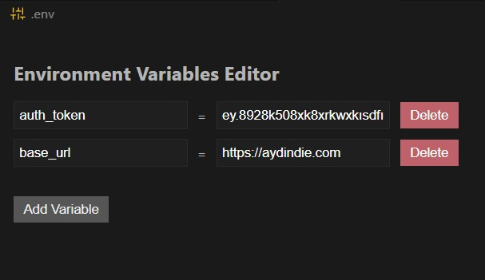

# VSCode Environment Viewer

A simple VSCode extension that displays environment variables from .env files in a clean, readable format.

## Features

* Opens .env files in a clean, readable format
* Displays environment variables in textboxes
* Supports VSCode's theme colors
* Maximum width constraint for better readability
* Easy to use interface for adding, editing, and deleting environment variables

## Installation

1. Open VS Code
2. Press `Ctrl+Shift+X` (Windows/Linux) or `Cmd+Shift+X` (Mac)
3. Search for "VSCode Environment Viewer"
4. Click Install

## Usage

1. Open a .env file in VS Code
2. The environment variables will be displayed in a new panel
3. You can:
   - Add new variables using the "Add Variable" button
   - Edit existing variables by clicking on them
   - Delete variables using the delete button
   - Use Tab key to navigate between fields
   - Press Enter to add a new variable

## Requirements

* VSCode 1.74.0 or higher

## Extension Settings

This extension contributes the following settings:

* `envEditor.editor`: Custom editor for .env files

## Known Issues

None at the moment.

## Release Notes

### 0.0.1

Initial release of VSCode Environment Viewer

## Contributing

Contributions are welcome! Please feel free to submit a Pull Request.

## License

This project is licensed under the MIT License - see the [LICENSE](LICENSE) file for details. 